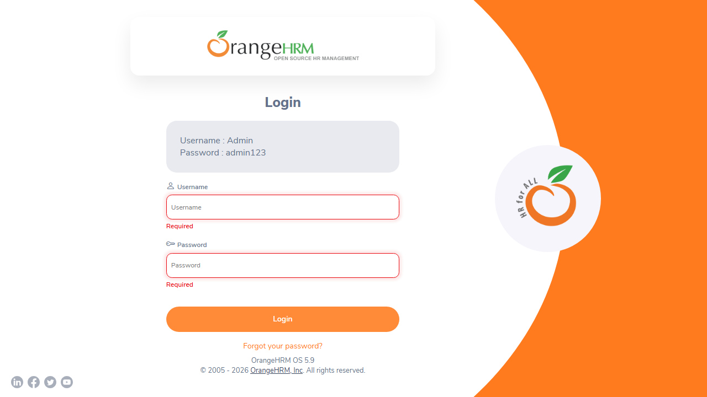

# Defect / Bug Report

## Bug Summary
- **Bug ID**: `BUG-ORANGE-001`
- **Title**: Mandatory field validation triggers on empty credential submission and persists until field defocus
- **Module**: Authentication / Login
- **Severity**: Medium
- **Priority**: High
- **Reported By**: SQA Manual Tester
- **Date Reported**: 2026-09-11
- **Status**: Open
- **Environment**: Windows 11, Chromium (Version 120+), Web Application (OrangeHRM OS 5.9)

---

## Description
When accessing the OrangeHRM login page (`/web/index.php/auth/login`) and clicking the **Login** button without providing credentials, client-side validation triggers and highlights both input boxes in red with an inline error message `"Required"`. 

During exploratory testing, when a user immediately clicks back into the field and begins typing valid credentials, the red error border and `"Required"` warning text do not dynamically disappear on input keyup/change; they remain visible until the input is completely blurred or resubmitted, causing visual confusion and degraded user experience.

---

## Steps to Reproduce
1. Open the browser and navigate to `https://opensource-demo.orangehrmlive.com/web/index.php/auth/login`.
2. Ensure both **Username** and **Password** fields are completely empty.
3. Click the orange **Login** button.
4. Observe the red validation state and error message below both input fields.
5. Click into the **Username** field and start typing a character.
6. Observe the error label state while typing.

---

## Expected Result
- Inline error message `"Required"` and red input border should dynamically clear as soon as the user enters valid characters (`onInput` / `onChange` event).

---

## Actual Result
- The red error state and `"Required"` message remain statically displayed until the input loses focus or the form is resubmitted.

---

## Defect Evidence / Screenshot


---

## Impact & Suggested Fix
- **Impact**: Inconsistent UI feedback gives users the impression that their typed input is still considered missing or invalid while they are actively typing.
- **Suggested Fix**: Update input change listeners to clear error state on keypress/input:
  ```javascript
  onInput: (e) => {
    if (e.target.value.trim().length > 0) {
      clearFieldError(e.target.name);
    }
  }
  ```
