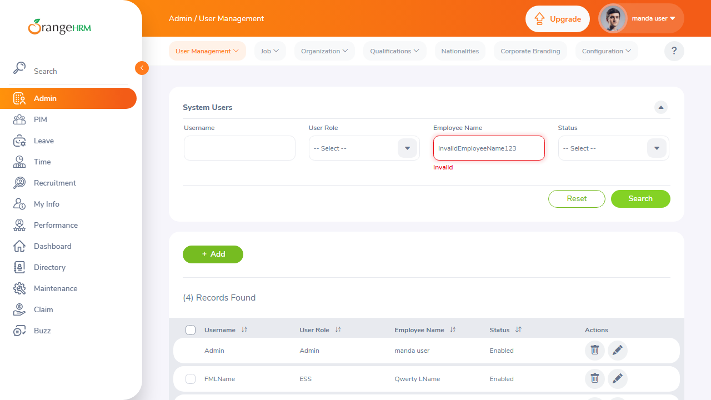

# Defect & Bug Reports

This document contains formal bug reports logged during exploratory manual testing of the OrangeHRM system across the Authentication and Admin modules.

---

## Bug Report 1: BUG-ORANGE-001

### Summary
- **Bug ID**: `BUG-ORANGE-001`
- **Title**: Mandatory field validation triggers on empty credential submission and persists until field defocus
- **Module**: Authentication / Login
- **Severity**: Medium
- **Priority**: High
- **Reported By**: naimur
- **Date Reported**: 2026-09-11
- **Status**: Open
- **Environment**: Windows 11, Chromium Browser, OrangeHRM OS 5.9

### Description
When accessing the OrangeHRM login page (`/web/index.php/auth/login`) and clicking the **Login** button without providing credentials, client-side validation triggers and highlights both input boxes in red with an inline error message `"Required"`. 

During exploratory testing, when a user immediately clicks back into the field and begins typing valid credentials, the red error border and `"Required"` warning text do not dynamically disappear on input keyup/change; they remain visible until the input is completely blurred or resubmitted, causing visual confusion and degraded user experience.

### Steps to Reproduce
1. Open browser and navigate to `https://opensource-demo.orangehrmlive.com/web/index.php/auth/login`.
2. Ensure both **Username** and **Password** fields are completely empty.
3. Click the orange **Login** button.
4. Observe the red validation state and error message below both input fields.
5. Click into the **Username** field and start typing a character.
6. Observe the error label state while typing.

### Expected Result
- Inline error message `"Required"` and red input border should dynamically clear as soon as the user enters valid characters (`onInput` / `onChange` event).

### Actual Result
- The red error state and `"Required"` message remain statically displayed until the input loses focus or the form is resubmitted.

### Defect Evidence / Screenshot


### Impact & Suggested Fix
- **Impact**: Inconsistent UI feedback gives users the impression that their typed input is still considered missing or invalid while they are actively typing.
- **Suggested Fix**: Update input change listeners to clear error state on keypress/input:
  ```javascript
  onInput: (e) => {
    if (e.target.value.trim().length > 0) {
      clearFieldError(e.target.name);
    }
  }
  ```

---

## Bug Report 2: BUG-ORANGE-002

### Summary
- **Bug ID**: `BUG-ORANGE-002`
- **Title**: Admin User Management search retains and displays previous records grid when Employee Name validation fails with "Invalid"
- **Module**: Admin / User Management
- **Severity**: Medium
- **Priority**: Medium
- **Reported By**: SQA Manual Tester
- **Date Reported**: 2026-09-12
- **Status**: Open
- **Environment**: Windows 11, Chromium Browser, OrangeHRM OS 5.9

### Description
On the Admin User Management page (`/web/index.php/admin/viewSystemUsers`), the search filter form provides an autocomplete input for **Employee Name**. If a user enters an unlisted or arbitrary name (e.g. `"InvalidEmployeeName123"`) without selecting from the dropdown suggestions and clicks the green **Search** button, the system marks the field as `"Invalid"` in red.

However, instead of blocking the search query or clearing the results table to indicate an erroneous filter state, the results grid below continues to display the full previous table contents (e.g., `(4) Records Found`), misleading the administrator into believing the displayed records belong to or match the invalid search criteria.

### Steps to Reproduce
1. Log in to OrangeHRM as Administrator (`Admin` / `admin123`).
2. From the left sidebar, navigate to the **Admin** module.
3. On the **System Users** page, locate the **Employee Name** search field.
4. Type an unlisted or random employee name (e.g., `"InvalidEmployeeName123"`) and do not select any dropdown suggestion.
5. Click the green **Search** button.
6. Observe the validation error under the Employee Name field and the table state below.

### Expected Result
- The search execution should be blocked while a filter field contains a validation error.
- The results table should either be cleared with an instructional warning or state `(0) Records Found` until valid search criteria are provided.

### Actual Result
- The field turns red with error `"Invalid"`, yet the search operation retains and displays all previously loaded records (e.g. `(4) Records Found`), causing data ambiguity.

### Defect Evidence / Screenshot


### Impact & Suggested Fix
- **Impact**: Administrators searching for users by employee name can mistakenly believe the displayed records correspond to the entered name when the search filter actually failed validation.
- **Suggested Fix**: Prevent form submission and disable the Search action when autocomplete fields fail reference resolution:
  ```javascript
  if (isFieldInvalid('employeeName')) {
    e.preventDefault();
    clearResultsTable();
  }
  ```
